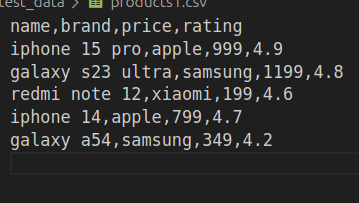
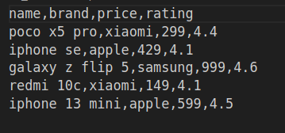
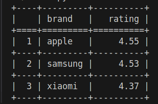

### tests and linter status:

[](https://github.com/ttehasi/python-project-50/actions)
[](https://codeclimate.com/github/ttehasi/python-project-50/maintainability)
[](https://codeclimate.com/github/ttehasi/python-project-50/test_coverage)
## What is this?
#### Этот проект представляет собой консольную утилиту для обработки csv файлов и предоставления отчета в консоль в виде таблицы.


### Setup

```bash
make install
```


### Run tests

```bash
make test
```
## Режимы работы
### Режим по умолчанию
#### Режим по умолчанию(то есть без опций) выводит результат в виде таблице в которой собраны результаты средней оценки по брендам в исходных файлах.

## Как это работает

### Представим у вас есть два вот таких вот файла(файлов может быть неограниченно):
#### Файл первый



#### Файл второй



### И вы хотите узнать среднюю оценку брендов. Для этого вам нужно написать в консоли из корня кроекта:

```
uv run python csv_project/scripts/main.py --files path_to_file1 path_to_file2 [--report]
```

### Флаг --report это то, что вы хотите увидеть в отчете (по умолчанию average_rating)

### В данном случае мы получим вот такой вот результат:




### Links

This project was built using these tools:

| Tool                                       | Description                                                            |
|--------------------------------------------|------------------------------------------------------------------------|
| [uv](https://docs.astral.sh/uv/)           | "An extremely fast Python package and project manager, written in Rust" |
| [Pytest](https://pytest.org)               | "A mature full-featured Python testing tool"                           |
| [ruff](https://docs.astral.sh/ruff/)       | "An extremely fast Python linter and code formatter, written in Rust"  |

